# 3장 저수준 계층? 메모리라는 사물함에서부터 시작해 보자

## 메모리의 본질, 포인터와 참조

메모리는 1과 0으로 이루어진 수많은 매모리 셸로 이루어져 있고, 이는 각 1비트이며 이를 8개 묶으면 1바이트가 된다. 

1바이트마다 번호를 붙이게 되면, 모든 바이트는 메모리 내 주소를 가지게 되며 이를 memory address 라고 한다.

그러나 1바이트는 8비트이므로 최대 표현할 수 있는 수는 0~255인 266개 뿐이라서, 이걸 4개 묶어 4바이트로 표현하고 흔히 아는 integer로 표현한다. 하지만 키, 몸무게 ,신체 등과 같은 여러 정보를 표현하려면 더 많은 바이트가 필요하고 이를 조합해서 사용하는데 이것을 객체 또는 구조체 라고 한다.


8바이트 메모리가 주어졌을 때 1 + 2를 계산하고 싶다고 가정하자.  

먼저 숫자 1과 2를 메모리 저장해야 CPU가 값을 읽어 레지스터에 저장해야 연산을 수행할 수 있다.

메모리 주소 0~ 7이있을 때,  주소 6번에 1을 저장한다고 표현하면 주소 6 = 숫자 1이다.

근데 주소 6은 인간에게 익숙하지 않으므로 a = 1 이라고 표현할 수 있다. 이 a가 변수이다.

b 변수에 a 값을 저장하려면   b = a 로 표현할 수 있다.

 여기서 만약 a 변수가 구조체나 객체처럼 여러 바이트를 차지한다면?

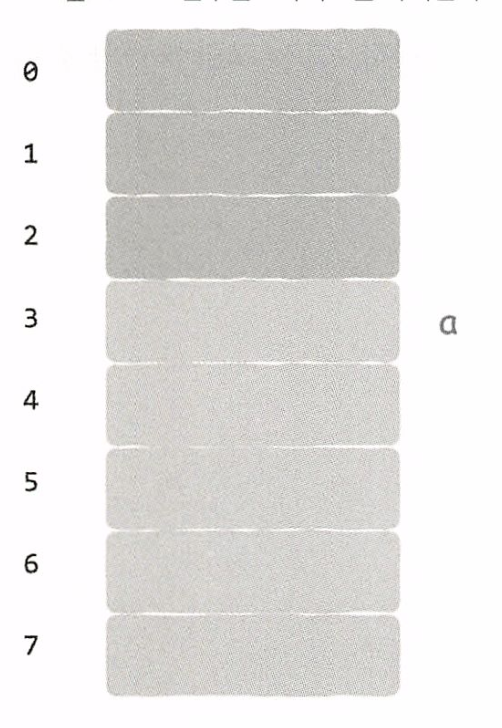

이는 전체 8비트 중 절반 이상을 차지하며 b = a를 표현해야 한다면 어떻게 할 수 있을까? 

불필요한 데이터 복사본 필요 없이, 변수가 저장된 메모리 공간을 가리키면 된다.

변수를 사용할때의 장점은, b 변수가 실제로 어디 저장되어 있는지는 관심 없고 변수가 가리키는 값이 메모리주소 어디에 저장되어있지만 알면 된다.

### 포인터의 힘과 파괴력

포인터를 지원하지 않는 언어에서 c = a + b 라는 코드는 주소 개념이 없다. 존재한다만 알면 된다.

반면 포인터를 지원하는 c언어 등에서는 값과 메모리 주소를 모두 저장할 수 있다.

그말인즉슨 메모리같은 하드웨어를 직접 조작할 수 있따는 이야기이다. 

반면 포인터 연산에 오류가 있을 경우 프로그램 실행 상태를 직접 파괴가 가능한 위험성이 있다. 

포인터는 메모리 주소를 추상화한 것이고, 참조는 포인터를 한번 더 추상화 한것이다. 

그러나 메모리 자체도 한번 더 추상화 될 수 있다. 이것이 가상 메모리이다.

가상 메모리를 지원하는 현대 시스템에서 프로세스가 사용하는 메모리 주소는 실제 물리 메모리 주소가 아니다. 

## 프로세스는 메모리 안에서 어떤 모습을 하고 있을까?

64비트 시스템에서 메모리 내 프로세스 구조는 그림과 같다.

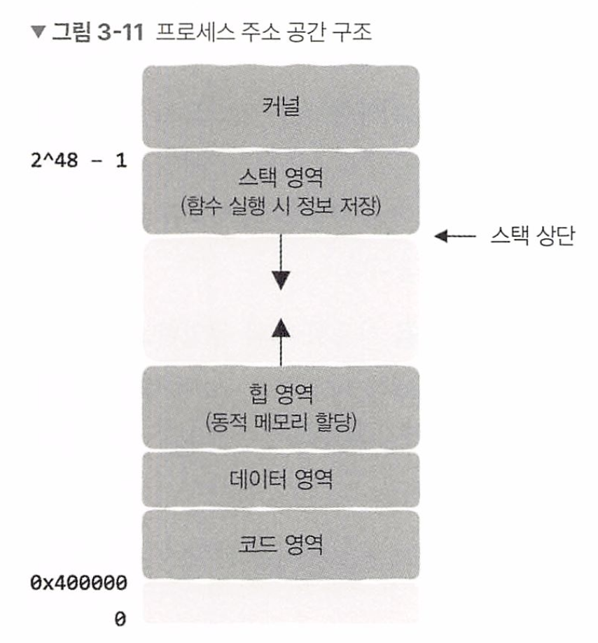

코드영역과 데이터 영역은 실행 파일 초기화시 생성되는 영역

힙영역은 프로세스 실행 중 동적 메모리 할당에 사용

스택 영역은 함수 호출에 사용되며 매개 변수, 반환 주소, 레지스터 정보 등을 포함한 정보들을 저장하는데 사용된다.

### 가상 메모리

위 그림에서 보면 모든 프로세스의 코드 영역이 0x4000000에서 시작한다. 서로 다른 프로세스가 둘다 0x7f64cb8을 반환하는 등 동일한 시작 주소를 반환하는데, 그럼 겹쳐서 문제되지 않을까?

이것은 문제되지 않는다. 이 메모리 주소는 가짜 주소이며, 메모리 조작이 일어나기 전에 실제 물리 메모리 주소로 변경된다. 오히려 실제 물리 메모리에서 보여주는 모습은 아래와 같다.

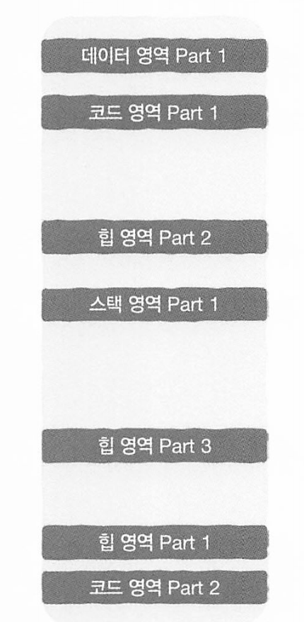

이렇게 동일한 크기의 조각으로 무작위로 흩어져 있어도 서로의 주소 공간을 방해하지 않는다

이것은 가상 메모리와 물리 메모리 사이의 사상(mapping)과 page table 덕분이다

### 페이지와 페이지 테이블

가상 메모리 주소와 물리 메모리 주소의 매핑이 유지되는 한 프로세스 주소 공간의 데이터가 실제 물리 메모리 어디에 저장되는지 전혀 신경 쓸 필요가 없다.

모든 가상 주소를 물리 주소에 매핑하는 대신 프로세스의 주소 공간을 동일한 크기의 조각으로 나누고, 이 조각을 page 라고 부른다. 

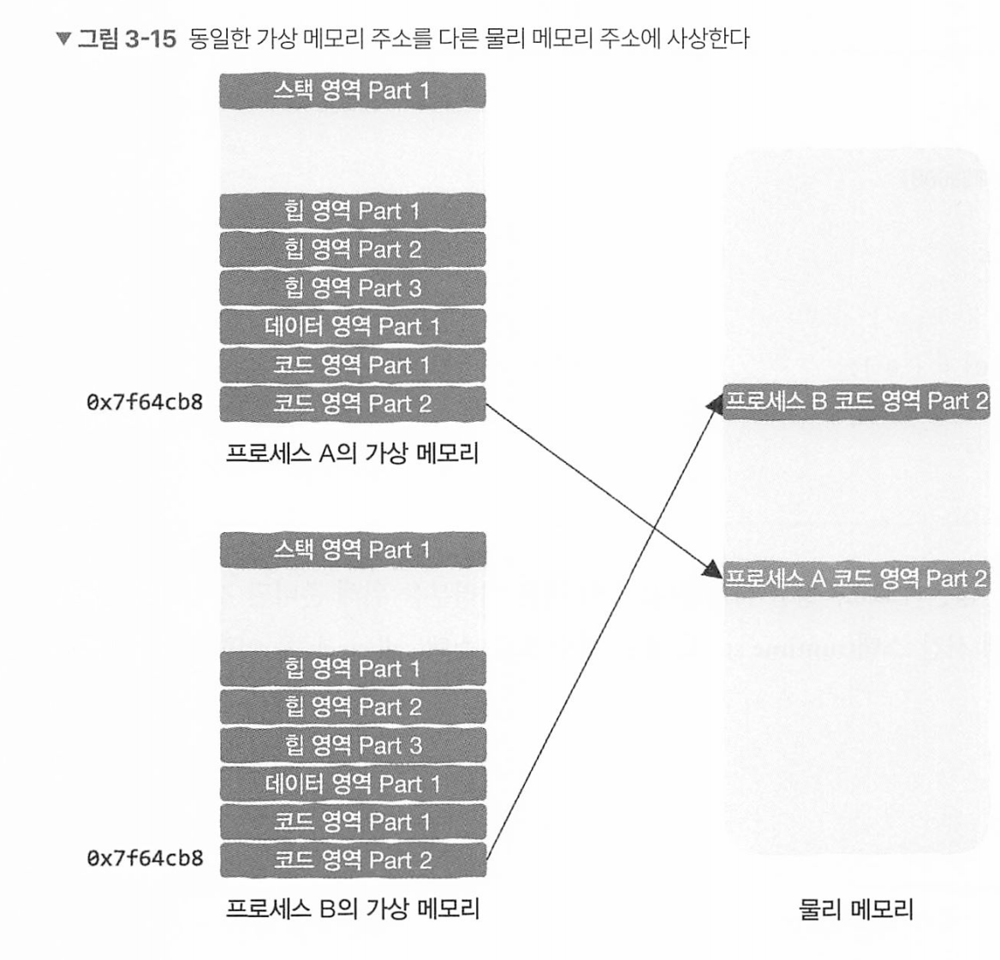

두 프로세스가 동일한 메모리 주소에 기록하더라도, 동일하게 보이는 메모리 주소는 가상 메모리이며 실제로는 서로 다른 물리 메모리에 저장된다. 

## 스택 영역 : 함수 호출은 어떻게 구현될까?

### 스택 프레임 및 스택 영역 : 거시적 관점

모든 함수는 실행 시 자신만의 작은 상자가 필요하다. 이 상자 안에는 함수 실행시 사용되는 여러 정보가 저장되어 있으며 스택 구조로 구성된다.

각각의 작은 상자를 stack frame 또는 call stack 이라고 한다. 

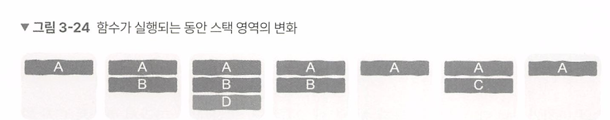

꼭 알아야 할 점은 프로세스 스택 영역의 높은 주소가 위에 있고 스택 영역은 낮은 주소로 커진다.

즉 스택 영역이 차지하는 메모리는 함수 호출 깊이에 따라 증가하고, 함수 호출이 완료될 수록 감소한다.

### 함수 점프와 반환은 어떻게 구현될까?

함수 A가 함수 B를 호출하면, 제어권이 함수 A에서 B로 옮겨진다. 제어권이란, 실제로 CPUrㅏ 어떤 함수에 속하는 명령어를 실행하는지를 의미한다. 

제어권이 이전될때는 다음 두 가지 정보가 필요하다

* return : 어디에서 왔는지에 대한 정보
* jump : 어디로 가는지에 대한 정보.

함수 A가 B를 호출할때는

* 함수 A의 기계 명령어가 어디까지 실행되었는지(어디에서 왔는지)
* 함수 B의 첫번째 기계 명령어가 위치한 주소(어디로 가는지)

이 정보들은 스택 프레임에 저장된다.

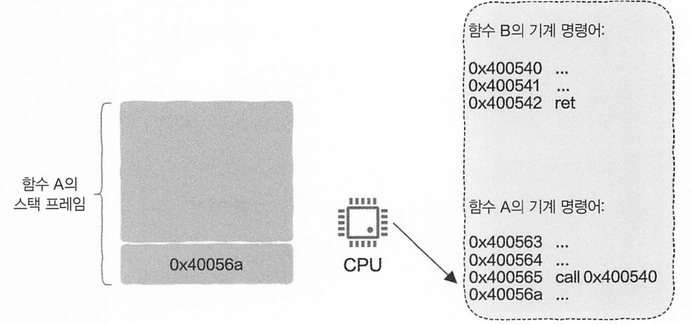

실행할 B 함수의 첫번째 기계 명령어 메모리 위치와,  실행이 끝나고 돌아올 위치인 A함수 내의 B함수를 실행한 다음 위치를 함수 A의 스택 프레임에 넣는다

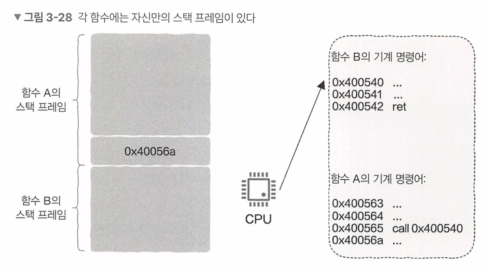

함수 B를 호출했기 때문에 새로운 스택 프레임이 추가되며 스택 영역이 차지하는 메모리 크기도 증가된다.

만약 함수 B에서 다시 다른 함수가 호출되면 새로운 스택 프레임이 생성되며 프로세스의 스택 영역은 또 한번 늘어난다.

이런식으로 함수 B는 마지막 기계 명령어인 ret까지 계속 실행되고, ret이 실행되면 (return) 함수 A의 스택 프레임에 저장된 반환 주소 점프하도록 전달하도록 한다. 


이렇게 함수가 다른 함수를 실행할때 제어권이 이동된다. 

### 매개변수 전달과 반환값

함수 호출시 함수 이름 외에도 매개변수와 반환값을 어떻게 전달할까?

x86-64 시스템 아키텍처의 경우 매개변수의 전달과 반환값을 가져오는 작업을 레지스터로 한다.

함수 A가 함수 B를 호출한다면 함수 A는 매개변수를 상응하는 레지스터에 저장하며, CPU가 함수 B 실행시 이 레지스터에서 매개변수 정보를 얻을 수 있다.

* 레지스터(Register)는 컴퓨터 프로세서(CPU) 내부에 있는 **고속 저장 장치**. 데이터를 임시로 저장하고 처리하는 아주 빠른 메모리 공간
* 일반적으로 CPU에는 몇 개에서 몇십 개의 레지스터만 존재

매개변수 수가 레지스터 수보다 많으면 나머지 매개변수는 스택 프레임에 직접 넣을 수 있기 때문에 새로 호출된 함수가 이전 함수의 스택 프레임에서 매개변수를 가져온다. 

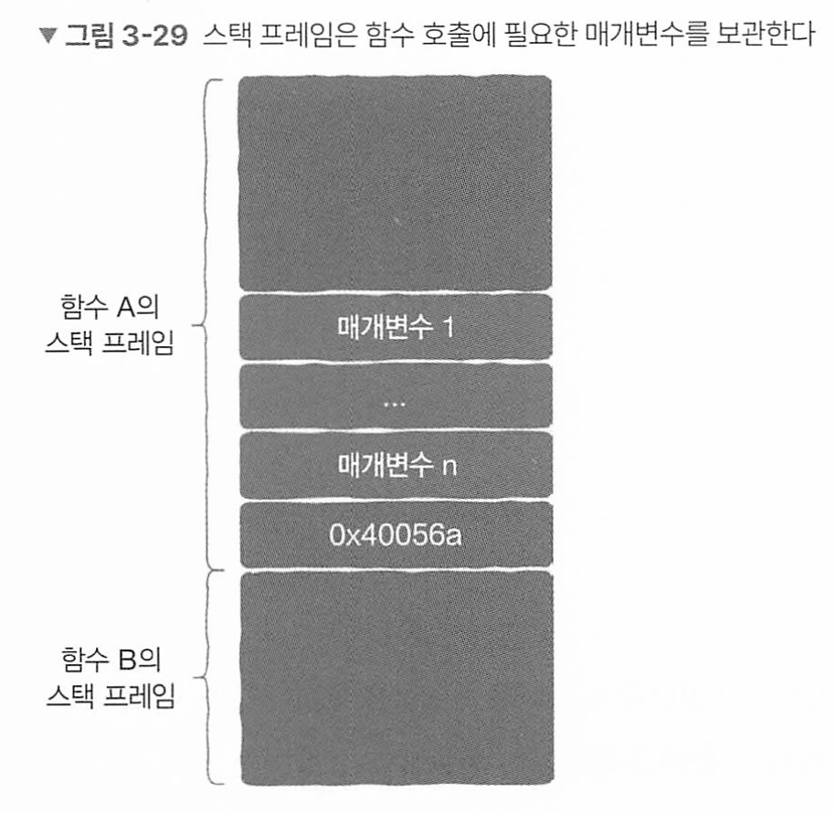

* 매개변수는 원래 스택에 저장된다고 했었다.

### 지역 변수는 어디에 있을까

함수 내부의 지역 변수도 레지스터에 저장되거나 레지스터 수보다 많으면 이 변수들도 스택 프레임에 저장된다.


레지스터는 CPU 내부에 있고, 서로 다른 함수 A,B가 레지스터 사용시 지역 변수 정보를 덮어 쓰는 문제가 생기지 않을까? 


이를 방지하기 위해, 레지스터에 지역변수를 저장하기 전 먼저 레지스터에 저장되었던 초깃값을 꺼냈다가 레지스터를 사용하고 나면 그 초깃값을 스택 프레임에 저장한다.

### 큰그림

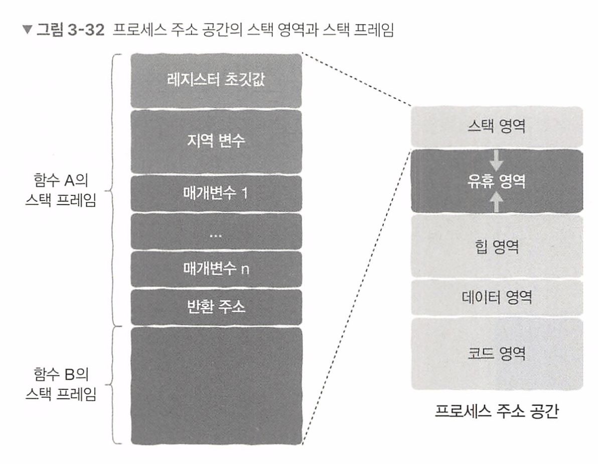

* 스택 프레임은 스택 영역에 존재하며 스택 영역은 프로세스 내에 존재한다.

아래 코드는 자기 자신을 1억번 호출한다

```c
void func(int a) {
  if (a > 100000000) {
    return;
  }
  
  int arr[100] = {0};
  func(a + 1);
}

void main() {
  func(0);
}
```

함수호출 단계가 증가함에 따라 스택 영역은 계속 메모리를 추가 사용하지만 스택 영역의 크기에는 제한이 있다.

이 제한을 초과하면 stack overflow가 발생하므로, 너무 큰 지역변수를 만들거나 함수 호출 단계가 너무 많으면 안된다.

### **매개변수가 레지스터에 저장되지 못한다는 것을 어떻게 알 수 있을까요?**

컴파일러는 함수 호출 규약(**Calling Convention**)에 따라 매개변수를 레지스터에 저장하거나 스택에 저장할지를 결정합니다. 각 아키텍처는 특정한 호출 규약을 정의하고, 이에 따라 매개변수를 저장합니다.

예를 들어:

- **x86 아키텍처 (32-bit)**: 보통 레지스터 수가 제한되어 있어, 대부분의 매개변수는 스택에 저장됩니다.
- **x86-64 아키텍처 (64-bit)**: 일반적으로 처음 몇 개의 매개변수는 레지스터(RDI, RSI, RDX 등)에 저장되고, 초과하는 매개변수는 스택에 저장됩니다.
- **ARM 아키텍처**: 매개변수는 레지스터 R0~R3에 저장되고, 초과하는 매개변수는 스택에 저장됩니다.

따라서 컴파일러는 **매개변수의 개수**와 **사용 가능한 레지스터 수**를 바탕으로 레지스터에 저장 가능한지 여부를 알 수 있습니다.

### **스택 영역의 증가와 감소는 구체적으로 어떻게 구현될까요?**

스택 영역의 증감은 프로세서의 **스택 포인터 (Stack Pointer, SP)**를 조작함으로써 이루어집니다. 매개변수가 레지스터에 모두 저장되지 못할 경우, 초과된 매개변수는 함수 호출 시 스택에 저장되며, 이 과정에서 스택 포인터가 업데이트됩니다.

구체적인 구현 과정은 다음과 같습니다:

1. 함수 호출 시:
   - 초과 매개변수를 스택에 **푸시(push)**합니다.
   - 스택 포인터가 감소합니다 (스택은 메모리 상에서 높은 주소에서 낮은 주소로 성장).
2. 함수가 종료될 때:
   - 스택에서 값을 **팝(pop)**하여 제거합니다.
   - 스택 포인터가 증가합니다.

### **이를 구현하는 책임은 누구에게 있을까요?**

이를 구현하는 책임은 주로 **컴파일러**에 있습니다. 컴파일러는 함수 호출 규약을 준수하여:

- 어떤 매개변수를 레지스터에 저장하고,
- 어떤 매개변수를 스택에 저장할지를 결정합니다.

컴파일러는 호출 규약에 따라 함수 호출 시 필요한 스택 조작 코드를 생성합니다. 이외에도 운영 체제와 CPU 아키텍처가 제공하는 규약을 준수하여 코드가 올바르게 실행되도록 보장합니다.


## 3.4 힙 영역: 메모리의 동적 할당은 어떻게 구현될까?

스택 프레임은 스택 영역 내에 구성되기 때문에 함수의 호출 단계가 증가할 때마다 스택 영역이 차지하는 메모리가 늘어난다. 함수 호출이 완료되면 기존 스택 프레임 정보는 더이상 사용되지 않으므로 메모리는 줄어든다.

개발자는 앞의 내용을 기반으로 두 가지 내용에 주의해야 한다 

1. 함수 A가 함수 B 호출시 스택 내용들은 무효화 되므로 무효화된 스택 내용에 대해서 어떤 가정도 하면 안된다. 
2. 지역변수의 life cycle은 함수와 동일하다. 함수 호출이 완료되면 스택 프레임이 무효화 되며 해당 사용된 메모리들은 다른 함수에서 가져와 사용할 수 있으므로 직접 지역 변수가 사용할 메모리의 할당과 반환 문제에는 신경 쓸 필요가 없다. 

### 힙 영역이 필요한 이유

특정 데이터가 여러 함수에 걸쳐 사용해야 한다면? 프로그래머가 해당 메모리 영역이 사용이 완료되엇다고 하기 쩐가지 유효하게 유지할라면? 이 경우에 동적 메모리 할당과 해제를 사용한다.

메모리 수명주기에는 프로그래머가 직접 제어할 수 있는 매우 큰 메모리 영역을 heap segement 라고 한다.


메모리 할당시 4가지 문제가 있다.

1. 메모리 요청시 메모리에서 적절한 크기의 여유 메모리를 찾아야 하는데 어떤 메모리가 할당되어있고 어떤 메모리가 여유 메모리인지 어떻게 알 수 있을까?
2. 메모리가 16바이트, 32바이트, 8바이트 등으로 조각화 되어있을때 어떤 여유 메모리 조각을 반환해야 할까?
3. 16바이트 메모리를 요청해야 하는데 찾은 여유 메모리 조각이 32바이트라면 할당하고 남은 메모리는 어떻게 처리할까?
4. 할당되엇던 메모리 사용이 완료되면 어떻게 처리해야 할까?

### 여유 메모리 조각 관리하기

연결리스트를 통해 메모리 사용 정보를 메모리 조각 자체에 함께 저장한다. 이 연결리스트에는 다음 노드가 어디있는지 알려주는 포인터는 없지만 메모리 사용 정보로 다음 노드 위치를 유추하는 것이 가능하다. 다음 두가 지정보만 기록하면 된다.

* 메모리 조각이 비어있는지 알려주는 flag
* 메모리 조각의 크기를 기록한 숫자

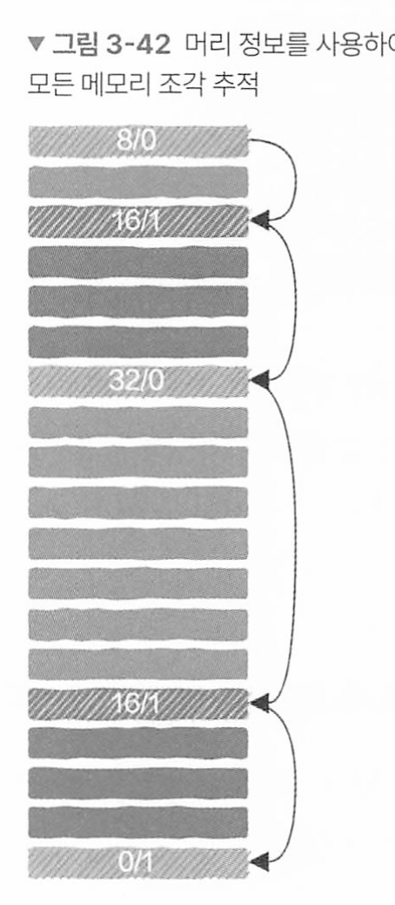

* 16/1은 16바이트가 할당
* 32/0은 여유 메모리가 32바이트가 있다
* 마지막 0/1는 tail node라는 의미

즉 전체 힙 영역을 쉽게 추적할 수 있다. 

### 어떻게 여유 메모리 조각을 선택할 것인가 : 할당 전략

4바이트 메모리 요청시 8바이트 조각과 32바이트 중 어떤것을 반환해야 할까?

#### 1. 최초 적합 방식

처음부터 탐색하다가 가장 먼저 발견된 요구사항을 만족하는 항목 반환

* 장점 : 단순

* 단점 : 메모리 단편화가 발생할 가능성이 매우 높음 

#### 2. 다음 적합 방식 (next fit)

최초 적합과 유사하지만, 처음부터 검색하는 대신 적합한 여유 메모리 조각이 마지막으로 발견된 위치에서 시작한다느점이 다름. 그러나 다음 적합 방식의 메모리 사용률은 최초 적합 방식에 미치지 못한다는 것이 연구로 밝혀짐.

#### 3. 최적 적합 방식

사용 가능한 메모리 조각을 모두 찾은 후 그중 요구 사항을 만족하면서 크기가 가장 작은 조각을 반환. 

* 장점 : 메모리를 더 자활용
* 단점: 사용가능한 모든 메모리 조각을 탐색해야 하므로 최초 적합보다 빠르진 않음

### 메모리 해제하기

메모리 해제 함수(free)에 메모리 요청시 얻은 주소를 전달하기만 하면 머리 정보 크기인 4바이트를 빼는 것으로 메모리 조각의 머리 정보를 얻어 할당을 해제한다. 

## 메모리를 할당할 때 저수준 계층에서 일어나는 일

### 커널 상태와 사용자 상태 

 이 두 모드는 컴퓨터의 **하드웨어 보호**를 위해 나왔다. 

CPU가 OS의 코드 실행시 커널 상태에 놓인다. 커널 상태에서는 CPU가 모든 기계 명령어 실행 및 모든 주소 공간에 접근할 수 있다.

반면 프로그래머가 작성한 일반적인 코드를 CPU가 실행할 때는 사용자 상태이다. 사용자 상태에서는 여러 제한을 받으며 특정 주소 공간에는 절대 접근할 수 없다.  프로세스가 잘못된 동작을 하더라도, 커널과 다른 프로세스에 영향을 주지 않도록 보호된다. 

**사용자 상태와 커널 상태의 전환**

사용자 상태에서 커널 상태로 전환되는 일반적인 과정은 다음과 같다.

1. 시스템 호출 (System Call)
   - 응용 프로그램이 하드웨어 리소스에 접근하거나 운영 체제의 기능을 사용하려고 할 때 발생한다.
   - 예: 파일 열기, 네트워크 통신, 메모리 할당 등.
2. 인터럽트 (Interrupt)
   - 하드웨어 또는 소프트웨어 이벤트가 발생하여 CPU의 제어가 커널로 넘어갈 때 발생한다.
   - 예: 키보드 입력, 타이머 인터럽트, I/O 작업 완료 등.
3. 예외 (Exception)
   - 실행 중인 프로세스에서 오류(예: 0으로 나누기, 잘못된 메모리 접근 등)가 발생했을 때 커널로 전환된다.

### 시스템 호출(System call)

파일 읽기 쓰기 네트워크 송수신 등 커널 상태에서는 호출 할 수 있지만 사용자 상태에서는 운영체제의 코드를 실행할 수 없다. 응용 프로그램이 파일, 메모리, 네트워크, 하드웨어 리소스 등과 같은 **운영 체제에서 제공하는 서비스**를 사용해야 할 때 **시스템 콜**을 통해 요청한다. 

리눅스, 윈도우, 맥 등의 시스템간 차이를 감추기 위해 언어의 라이브러리들은 저수준의 시스템콜 계층을 감추고 api를 제공한다. 

### 힙 영역의 메모리 부족시

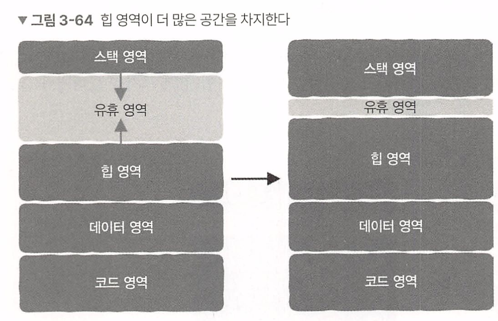

힙 영역과 스택 사이에는 여유 공간이 있는데, 스택이 함수 호출시마다는 아래로 공간을 잡아먹고 힙은 위로 공간을 잡아먹는다.  힙 영역이 모자를때, 힙 영역의 최상단을 가르키는 brk(break) 변수를 brk 시스템 콜을 이용하여 힙 영역의 크기를 늘리거나 줄인다. 

malloc 호출시 메모리가 모자르다면, malloc이 brk를 호출하여 운영체제에 메모리를 추가 할당을 요청하게 된다

### 가상 메모리

지금까지 설명한 brk 등을 이용해 확장한 힙 영역은 사실 모두 실제 메모리가 아닌 가상 메모리 공간이다.

실제 물리 메모리는 실제 할당한 메모리가 사용되는 순간에 물리 메모리를 할당하게 된다. 

이때 가상 메모리가 아직 실제 물리 메모리와 연결되어 잇지 않으면 페이지 폴트가 발생하고 사상을 수정하고 다시 실제 물리 메모리를 할당한다.


## 왜 SSD는 메모리로 사용할 수 없을까?

최신 ssd를 보면 순차 읽기 속도가 최대 7.5Gb/s에 달한ㄷ(pcie 4.0 기준, pcie 5.0은 그 두배)

이렇게 빠른데 왜? 메모리로 사용할 수 없을까?

5세대 ddr(ddr5)메모리 최대 대역폭은 60gb/s를 훨씬 넘는다.. 

### 메모리 읽기/쓰기와 디스크 읽기/쓰기 차이

메모리의 주소 지정 단위는 바이트이며 각 바이트마다 메모리 주소가 부여되어 CPU가 이 주소를 이용하여 해당 내용에 직접 접근할 수 있다.

반면 SSD는 그렇지 않다, SSD는 조각 단위로 데이터를(페이지, 4kb처럼) 관리하며 이 조각크기는 매우 다양하다. 

다시말해, CPU가 파일의 특정 바이트에 직접 접근할 수 없게 된다. 

메모리는 바이트단위, 디스크는 조각 단위로 지정된다.


### 가상 메모리의 제한

최신 os의 메모리 관리는 가상 메모리 기반이다.

주소 지정 범위(Address Space)는 컴퓨터 시스템에서 메모리 주소를 표현할 수 있는 범위를 의미하는데, CPU가 데이터를 저장하거나 읽을 수 있는 메모리 위치를 지정하는데 사용된다

32비트 시스템은 2^32 = 42억 (4gb)

64비트는 2^64 = 16엑사바이트

* 128비트는 비현실적으로 커서.. 2^128

32비트는 4gb라서 1tb가진 ssd를 메모리로 사용 불가, 64비트는 가능하다

### ssd 수명 문제

ssd는 수명이 있다. slc, mlc, tlc, qlc 가 있는데 보통 tlc이며 tlc는 1개의 셀에 3비트를 저장하며 약 1천번~3천번 쓰기/지우기가 가능하다. 때문에 프로그램 실행시마다 썻다/지웠다 하느 특성상 ssd는 ram을 대체하기에 적합하지 않다.

