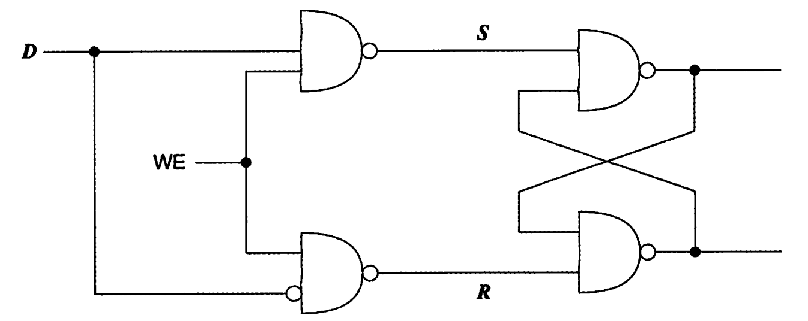
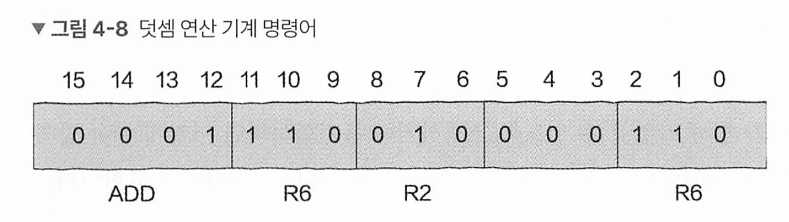
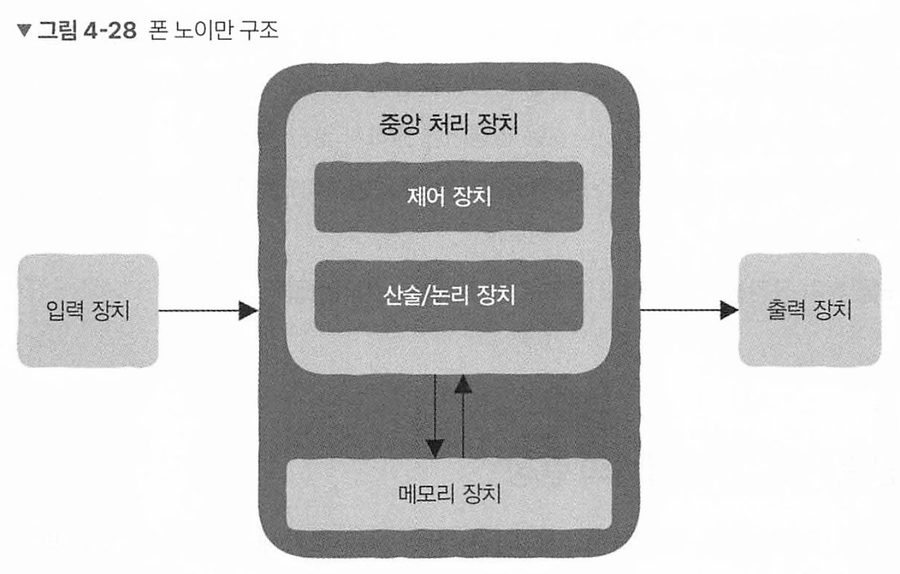
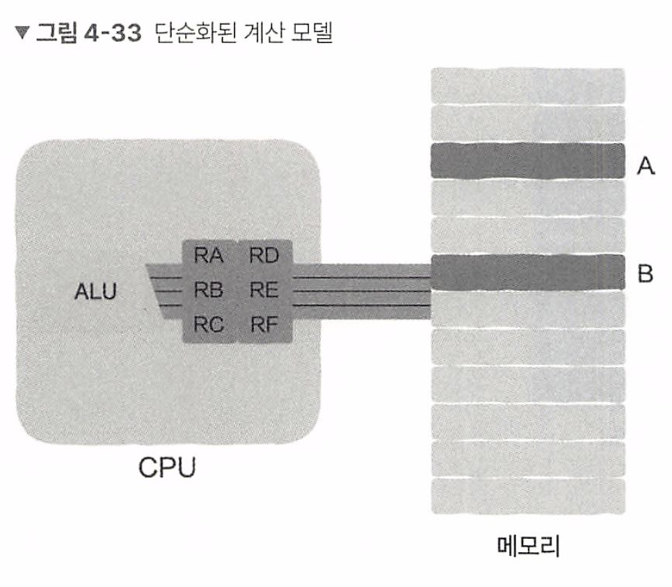
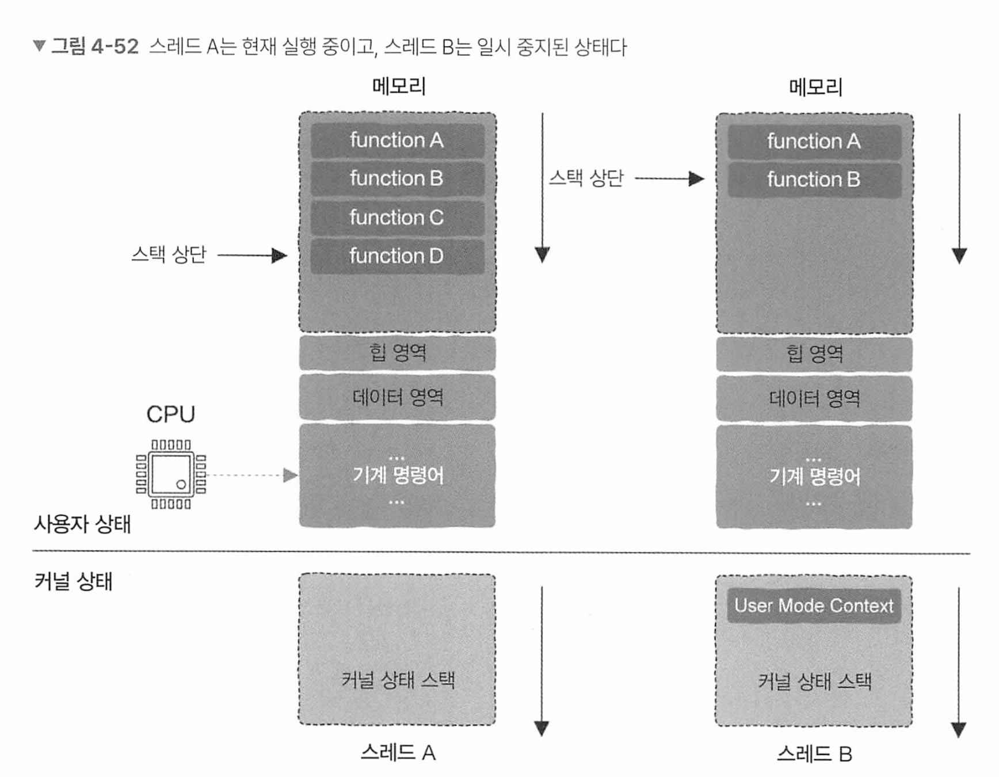

# 4장 트랜지스터에서 CPU로, 이보다 더 중요한 것은 없다

## 4.1 이 작은 장난감을 CPU라고 부른다

트랜지스터 : 단자 한쪽에 전류를 흘리면 나머지 단자 두개에 전류가 흐르게 할 수도 흐르지 못하게 할 수도 있다.

### 논리곱(AND), 논리합(OR), 논리부정(NOT)

트랜지스터라는 스위치를 기초로 블록을 만들 수 있음.

* **AND (논리곱)**: 두 스위치가 **모두** 켜져야(1) 전류가 흐르고 불이 켜짐
* **OR (논리합)**: **하나라도** 켜지면(1) 전류가 흐르고 불이 켜짐
* **NOT (논리부정)**: 스위치를 **닫으면**(0) 전류가 흐르고 불이 켜짐, **열면**(1) 전류가 차단되어 불이 꺼짐

### CPU의 연산 능력은 어디서 나올까

CPU는 0과 1 2진법만 안다. 2진법 덧셈은 다음과 같다

2진수에서 덧셈을 할 때, 다음 규칙이 성립

* 0 + 0 = 0, carry(자리 올림수) 0
* 0 + 1 = 1 자리 올림수 0
* 1 + 0 = 1 자리 올림수 0 
* 1 + 1 = 0 자리 올림수 1

**결과(Sum)**: 두 입력이 다를 때 1 → **XOR 연산**

**자리 올림(Carry)**: 두 입력이 모두 1일 때 1 → **AND 연산**

#### 신기한 기억 능력

특정 연산의 출력값이 다른 연산의 입력값으로 이용될 수 있다.

**부정 논리곱(NAND) 게이트** 두 개를 서로 연결하면 **기억하는 회로**가 됨

이 회로는 **S(설정, Set)과 R(리셋, Reset) 단자**를 사용하여 정보를 저장

**동작 방식**

- **S = 0, R = 1 → 출력(A) = 1** → "1을 저장"
- **S = 1, R = 0 → 출력(A) = 0** → "0을 저장"
- **S = 1, R = 1 → 기존 상태 유지**

즉, **한 번 입력된 값이 계속 유지되며, 필요할 때만 변경 가능**함 → **기억 능력!**




* **WE(Write Enable)** 신호를 추가하면, 저장 여부를 선택 가능
* 이 방식으로 **1비트 메모리(레지스터)**를 만들 수 있음
* D 단자가 0이면 전체 회로는 0이며 그렇지 않으면 1임. 

위 회로는 1비트를 저장할 수 있으며 더 많은 비트를 저장하려면 복제하여 붙여넣기만 하면 된다.

이 조합 회로가 레지스터이다. 이런 방식을 원리로 메모리가 구성된다.

### 하드웨어의 기본 기술 : 기계 명령

CPU에게 개발자가 명령어를 알려줘야 1 + 1을 계산한다. 

CPU는 덧셈 연산의 연산 능력만 제공하고, 개발자는 피연산자를 제공한다. 

### 소프트웨어와 하드웨어 간 인터페이스 : 명령어 집합

명령어 집합(instruction set)은 CPU가 실행할 수 있는 opcode와 각 명령어에 필요한 operand를 묶은것이다.



* 이 명령어는 16비트
* 처음 4비트는 CPU에 수행할 작업. => 기계 명령어는 2 ^4 = 16개 설계 가능 
* R6과 R2를 더한 후 R6에 기록한다. 

### 회로에는 지휘자가 필요하다.

회로는 연산 능력, 저장 능력을 갖추고 있으며 명령어를 전달해서 회로에 무엇을 해야하는지 알려줄 수 있다.

각 부분의 회로가 함께 작업할 수 있도록 조정하거나 동기화 하려면 지휘자가 필요하다

이 지휘자 역할이 바로 Cluck signal이다.

CPU의 클럭 주파수(dock rate)는 클럭 주파수는 1초 동 안 지휘봉을 몇 번 흔드는가를 의미하며, 클럭 주파수가 높을수록 CPU가 1초에 더 많은 작업 을 할 수 있음은 자명합니다

## 4.2 CPU는 유휴 상태일 때 무엇을 할까

### 프로세스 관리와 스케줄링

CPU 사용률을 보면 대부분 매우 낮으며 대부분 프로세스는 아무 작업 안하고 실행 상태로 있따. 특정 이벤트가 발생해야 CPU가 할당되고 작업을 하게 된다.

윈도우에서 System Idel Process항목이 CPU 사용률이 90%가 넘으면 해당 프로세스가 거의 모든 CPU 시간을 소모하고 있음을 의미한다.

운영체제는 내부적으로 대기열을 두고 우선수누이에 따라 스케줄러가 스케줄링 할 수 있도록 대기열에 프로세스를 넣어 실행한다.

### 대기열 상태 확인

만약 대기열이 비어 있따면, 실행해야 할 프로세스가 없고 CPU가 유휴 상태에 있따는 것을 의미한다.

```
if (queue.empty()) {
	do_someting();
}
```

매번 이렇게 체킹하면 코드가 매우 번잡해보일 수 있따.

이를 더 간단하게 해결하기 위해서는 대기열을 매번 가득 채워 스케줄러가 대기열에서 항상 실행할 수 있는 프로세스를 찾으면 된다.

이와 같이 커널 설계자는 idle worker라는 프로세스를 만들었는데, 이것이 윈도우의 system IdelProcess이다 

* Linux에서는 **PID 0**이 **CPU가 유휴 상태일 때 실행되는 idle 프로세스
* 이는 커널 내부에서 실행되며, **실제 사용자 공간에서 보이지 않는 프로세스**

실행할 프로세스가 없을때 이 유휴 프로세스를 꺼내어 실행한다, 항상 준비 완료 상태에 있으며 우선순위는 가장 낮다.

이렇게 해서 코드의 복잡도를 줄일 수 있게 된다.

### 모든것은 CPU로 돌아온다

CPU 설계자는 시스템에 유휴 상태가 존재할 가능성을 고려했기 때문에 하나의 기계 명령어를 설계했는데

이 기계 명령어가 정지를 의미하는 halt(hlt) 명령이다(x86 )

이 명령어는 CPU 내부 일부 모듈을 절전으로 배치하여 전력 소비를 줄인다. 

sleep 같은 함수랑 다르다. sleep은 해당 함수를 호출한 프로세스만 중지되고 cpu는 다른 프로세스를 실행하러 간다. 

내부적으로 아래처럼 된다고 생각하자

```
while (1) {
  while(!need_resched()) {
    cpuidle_idel_call();
  }
}
```

### 무한 순환 탈출 : 인터럽트

저렇게 무한 순환 구조인데 내부에는 break도 없고 return도 없는데 어떻게 순환을 빠져나올까?

os는 타이머 인터럽트를 통해 프로세스 스케줄링을 제어할 수 있다.

## 4.3 CPU는 숫자를 어떻게 인식할까?

컴퓨터 시스템이 2진법인 이유는 컴퓨터 저수준 계층이 각각 키고 끄는 상태만 있는 트랜지스터로 구성되있기 때문

### 숫자 0과 양의 정수

로마 숫자는 0이라는 개념이 없다. 숫자 205를 숫자 체계로 표기하면, 로마는 CCV, 아라비아는 205다

205 = 2 x 100 + 0 x 10 + 5 x 1

아라비아 숫자 체계에서는 값과 숫자의 위치가 직접적인 관계가 있는데, 이를 위치 기수법 (positional notation)이라고 한다 

* **위치 기수법**(Positional Notation)이란 **숫자의 위치에 따라 그 값이 결정되는 숫자 표기법**을 의미
* 일반적으로 사용되는 **십진법(Decimal, Base 10)**, **이진법(Binary, Base 2)**, **팔진법(Octal, Base 8)**, **십육진법(Hexadecimal, Base 16)** 등이 이에 해당

컴퓨터 2진법도 마찬가지로 위치기수법을 사용하며 숫자 5는

5 = 1 x 2^2 + 0 x 2^1 + 1 x 2 ^0

#### 부호 있는 정수

양의 정수의 표현은 간단함. k비트 = 2^k개

최상위 비트를 음수 양수 표현에 할당하면 양수 음수 표현이 모두 가능하다.

* 0은 양수 1은 음수

만약 4비트 1000이 -0을 의미하면 뭔가 이상하다. 0과 -0은 같기 때문이다. 이를 해결하기 위해1 의 보수가 나왔다.

**1의 보수(One’s Complement)**와 **2의 보수(Two’s Complement)**는 이진법에서 음수를 표현하는 두 가지 방

**1의 보수(One’s Complement)**

**방법:**
각 비트를 반전(**0 → 1, 1 → 0**)하여 구함.

**예제 (8비트 기준):**

```
  5  =  00000101 (원래 값)
 -5  =  11111010 (1의 보수)
```

그러나

*  **0이 두 가지 존재 (00000000 = +0, 11111111 = -0) → 비효율적**
*  **덧셈 연산 후 보정 필요**

이를 해결하는 

**2의 보수(Two’s Complement)**

**방법:**

1. 1의 보수를 구한 후 +1을 더함.
   - 즉, `1의 보수 + 1 = 2의 보수`

**예제 (8비트 기준):**

```
  5  =  00000101 (원래 값)
 -5  =  11111010 (1의 보수)
        +       1
       -----------------
 -5  =  11111011 (2의 보수)
```

**특징:**
✅ **0이 하나만 존재 (00000000 = +0)** → 더 효율적
✅ **덧셈 연산이 간편 (보정 없이 연산 가능)**
✅ **현대 컴퓨터에서 기본적으로 사용됨**

### CPU는 정말 숫자를 알고있을까?

컴퓨터의 가산기는 계산 과정에서 숫자가 양수인지 음수인지 신경쓰지 않는다. 의미도 이해하지 못한다.

0과 1로 구성된 01001100이라는 값을 우리 소프트웨어가 특정 색상이나 값이라는것을 해석하는것 뿐이다.

## 4.4 CPU가 IF 문을 만났을 때

리눅스에서 C언어로 크기가 10,000인 정수 배열을 만들고 배열에서 128보다 큰 모든 요소 합을 계 산시

정렬되어있다면 분기 예측 실패율이 0.02프로지만 정렬되지 않았다면 14.12%이다.

### if가 파이프라인을 만나면

CPU가 일할때, 명령어 인출, 명령어 해독, 실행, 다시 쓰기 등 이 단계가 끈임없이 교차적으로 반복하게 되어있다.

만약 분기 점프 명령어가 실행을 완료하기 전 다음 명령어는 파이프라인에 들어가 있어야 하는데, 없다면 빈 공간이 생겨 프로세서의 리소스를 100% 사용할 수 없다. 왜냐하면 어떤 분기의 명령어를 파이프라인에 넣어야 할지 모르기 때문이다.

이를 CPU는 미리 예측을 해서 처리한다.

만약 분기 예측이 틀리면, 실행중이던 잘못된 분기 명령어 전부를 무효화 하며 이것을 바로 성능 손실이 발생한다.

배열이 정렬되어 있으면 if > 256은 특정 이후부터는 매우 규칙적이다.

그렇지 않다면, 결과도 뒤죽박죽이므로 CPU는 추측하기 어렵다.

만약 높은 성능을 요구하는 코드를 작성하고 이 안에 if 문을 사용한다면, 추측 할 수 있도록 코드를 작성해야 한다.

## 4.5 코어 수와 스레드 수의 관계는 무엇일까

CPU는 하드웨어이고 스레드는 소프트웨어 개념, 실행 흐름이자 작업이다.

때문에 서로 알 필요가 없다.

스레드 사용하는 몇가지 상황인데, 일부 상황에서는 CPU 코어 수에 주의가 필요하다

### 4.5.3 다중 코어와 스레드

스레드 개념은 2003년부터 유행했다. 단일 코어의 성능을 더 끌어 올리기가 어려웄기 때문이다.

다중 프로세스는 프로세스간 통신, 컨텍스트 스위칭 등이 매우 어렵고 복잡하기 때문에 더 가벼운 스레드 개념이 유행하게 됐다.

만약 스레드가 순수하게 연산을 위하고 입출력 동기화 같은 작업이 없다면 코어당 스레드 하나가 적절하다.

다수의 입출력과 동기화가 필요하다면 스레드 수를 적당히 늘려 성능을 향상시킬 수 있다.

## 4.6 CPU 진화론 (상)

첫번째 명령어 집합 유형이자 처음으로 탄생했던 집합인 CISC가 있다.

CISC는 x86 아키텍처를 사용하는 인텔과 AMD cpu이다.



코드도 저장 구조를 차지한다. 기본적으로 폰 노이만 구조를 따르며, 핵심 사상은 '저장 개념에서 프로그램과 프로그램이 사용하는 데이터에 어떤 차이도 없이, 모두 저장 장치 안에 저장될 수 있어야 한다'

 과거 메모리는 수 kb밖에 안됐고 코드의 저장 공간을 절약해야 했기 때문에 복잡 명령어 집합을 만들었어야 했다.

그러나 명령어를 실행하는데 매우 효율적이지만 유연성이 떨어져 변경에 대응하기 어려웠다.

소프트웨어는 이와 다르게 쉽게 변경했다. 대부분의 명령에 포함된 연산을 더 간단한 명령어로 구성된 작은 프로그램을 CPU에 저장해 전용 하드웨어 회로를 설계할 필요를 없앴다. 이가 ROM이다.

단, 이것도 문제가 생겼는데 ROM도 코드이므로 버그가 생겼다. 이를 해결하기는 매우 어려웠다. 

때문에 다른 방식을 찾게 되었다.

## 4.7 CPU 진화론 (중)

시간이 흐르고 메모리 가격이 낮아지고 용량이 커졌다. 컴파일 기술도 발전을 이루어 쓸만해졌다.

직접 어셈블리어로 코드를 작성할 필요도 없어졌다.

### 복잡합을 단순함으로

파레토의 법칙인 전체 결과 80%가 원인의 20%에서 나온다는 법칙이, CPU에도 적용됌.

CPU는 약 80% 시간 동안 명령어 집합의 기계 명령어중 20%를 실행함.

복잡 명령어 집합에서 복잡한 명령어 중 일부는 자주 사용되지 않는다.

복잡 명령어 집합에 대한 반성을 바탕으로 축소 명령어 집합의 철약이 탄생했다.

1. 축소 명령어 집합의 특징 중 하나는 복잡 명령어를 제거하고 대신 간단한 명령어 여러개로 대체한다. 명령어 집합을 줄인다는 아이디어는 명령어 수가 줄어든다는 것이 아닌, 연산이 더 간단해진다는것
2. 축소 명령어 집합 사용시 컴파일러에게 더 많은 세부 사항을 알려준다
3. 축소 명령어 집합 명령어는 레지스터 내 데이터만 처리 가능하며 메모리 내 데이터는 직접 처리할 수 없다. 

### 복잡 명령어 집합과 축소 명령어 집합의 차이

#### 

오른쪽은 기계 명령어와 데이터를 저장하는 메모리고, 

왼쪽은 CPU이며, CPU 내부에 있는 것은 레지스터와 연산 장치인 ALU

축소 명령어 집합의 경우 연산시,

```
1. 메모리 주소 A의 데이터를 읽어 레지스터에 저장합니다.
2. 메모리 주소 B의 데이터를 읽어 레지스터에 저장합니다.
3. ALU가 레지스터 값을 이용하여 곱셈 연산을 수행합니다.
4. 곱셈 결과를 다시 메모리에 씁니다.


LOAD RA, A
LOAD RB, B
PROD RA, RB
STORE A, RA

```

* LOAD STORE만 가능하며 나머지는 CPU 내부의 레지스터만 처리가능함 

결국 명령어는 4개로 길어지지만, 컴파일러한테 맡기고 컴파일러가 구체적인 기계 명령어를 자동으로 생성한다.


결국 축소 명령어 집합 사용하는 상용 CPU들이 복잡 명령어 집합 구조를 사용하는 x86 들을 찢어 발겼다

그러나 인텔과 AMD의 엔지니어들이 이것을 반격했다.

## 4.8 CPU 진화론(하)

프로그래머는 인터페이스 개념을 알고있다. 함수의 큰 장점은, 함수의 인터페이스가 변경되지 않는 한 함수를 사용하는 코드는 변경될 필요가 없다.

이를 이용해, 인터페이스에 해당하는 명령어 집합은 바꿀 수 없지만 내부 구현 즉 명령어 실행 방식은 변경이 가능했다.

### 이길 수 없다면 함께해라 : RISC와 동일한 CISC

복잡 명령어 집합의 명령어를 CPU 내부에서 축소 명령어 집합의 간단한 명령어로 변환한다 이를 마이크로 명령어라고 한다. 컴파일러가 실행 파일 생성시 복잡 명령어 집합을 사용하지만, CPU 내부에서 명령어 실행시 축소 명령어 집합과 유사핟.

### 하이퍼 스레딩

하이퍼 스레딩 -> 하드웨어 스레드라고 하는데, 하이퍼 스레딩을 사용해서 운영체제에 환각을 심어 컴퓨터 시스템 코어 하나당 논리 CPU 코어가 여러개 있다고 인식하게 한다.

그 비밀은 하이퍼스레딩 기술이 탑재된 CPU는 한 번에 스레드 두 개에 속하는 명령어 흐름을 처리할 수 있으며, 이를 통해 CPU 코어 한 개가 CPU 코어 여러 개인 것처럼 보이게 할 수 있 다는 것.

원리는 파이프라인.

파이프라인은 항상 채워지지 않고 대부분 유휴 상태로 대기, 이를 이용해 추가 명령어 흐름을 도입해서 조금이라도 더 채워 실행하는것. 운영체제는 이게 진짜 인지 아닌지 상관없이 명령어를 전달한다.


### 오늘날

오늘날 스마트폰은 대부분 축소 명령어 집합 cpu인 ARM 프로세서를 달고 있다. 

## 4.9 CPU 스택과 함수 호출, 스레드 전환, 인터럽트 처리 통달하기

### 4.9.1. 레지스터

레지스터 : CPU에  있는 매우 빠른 캐시 메모리. 메모리와 속도가 100배정도 차이남.

레지스터가 훨씬 빠르지만 비싸기 때문에 프로세스 실행 정보를 모두 메모리에 저장하고, CPU가 사용할때만 레지스터에 데이터를 보관함.

몇가지 레지스터 데이터를 보자. 

#### 스택 포인터

스택의 가장 중요한 정보는 stack top, 이 정보는 stack bottom을 가리키는 stack pointer에 저장됌

함수 실행시, 내부에 정의된 로컬 변수와 매개변수 등을 저장하는 독립적인 메모리 공간을 스택 프레임이라고 함.

함수 호출이 깊어질수록 프레임 수도 증가하며, 완료시 반대로 줄어든다.

함수의 실행 시간 스택 정보는 명령어 주소 레지스터가 가지고 있다.

Progam counter 또는 IP, 또는 PC 레지스터 라고도 부른다.

프로그램 실행시 첫 번쨰로 실행할 기계 명령어 주소가 PC 레지스터에 저장되며, CPU는 레지스터에 저장되어 있는 주소에 따라 메모리에서 명령어를 가져와 실행한다. 

### 상태 레지스터

스택 레지스터와 명령어 주소 레지스터 외에도 status register가 있다.

올림수(carry)가 발생하거나 overflow 발생시 이 정보를 상태 레지스터에 저장한다.

그리고 커널 상태와 사용자 상태를 저장한다. 

### 상황 정보 (컨텍스트일까?)

프로그램 중지 및 재개시 필요하다.

프로그램은 엄격하게 순서대로 실행하지 않기 때문 (분기처리, 인터럽트 등 등 )

이 모두 스택을 이용해 상태 정보를 저장한다.

### 함수 호출과 실행시간 스택

모든 함수 실행시 독점적인 자신만의 저장공간을 가지고 있으며, 이 안에 함수 상태 정보를 저장하는데 이 공간을 스택 프레임이라고 한다.

### 시스템 호출과 커널 상태 스택

시스템 콜 요청시 운영체제가 내부 함수들을 호출하기 때문에 이 요청 처리 함수가 또 필요하다.

이 내부 함수 호출 실행시간 스택은 커널 상태 스택에 저장되어있다.

모든 사용자 상태 스레드는 커널 상태에 대응하는 커널 상태 스택을 가지고 있다.

시스템 콜이 호출되면 CPU는 사용자 상태에서 커널 상태로 전환되고, 사용자 상태 스레드에 대응하는 커널 상태 스레드를 찾아 기존 사용자 상태 스레드의 실행 상황 정보는 커널 상태 스택에 저장된다. 

ㅇㅣ것이 컨택스트 스위칭이다.

### 인터럽트와 인터럽트 함수 스택

키보드 입력, 마우스 입력, 네트워크 수신 등은 인터럽트 작동 방식을 통해 처리된다.

인터럽트는 CPU 실행 흐름을 끊고, 특정 인터럽트 처리 함수로 점프하며, 인터럽트가 끝나면 원래 위치로 점프한다.

인터럽트 함수의 실행 시간 스택은 2가지로 구현이 된다.

- 인터럽트 처리 함수에 자체적인 실행 시간 스택이 없는 경우 인터럽트 처리 함수는 커널 상태 스택을 이용하여 인터럽트 처리를 실행
- 인터럽트 처리 함수에 인터럽트 처리 함수(interrupt service routine) 스택, 즉 ISR 스택이라는 자 체적인 실행 시간 스택이 있는 경우가 있다. 인터럽트를 처리하는 것은 CPU라서 이때는 모든 CPU가 자신만의 인터럽트 처리 함수 스택을 가진다.

시스템 콜은 사용자 상태 프로그램이 직접 실행하지만, 인터럽트 처리는 외부 장치가 실행한다.

### 스레드 전환과 커널 상태 스택

시스템에 두 스레드 A,B가 있고 스레드 A는 현재 실행중이라고 가정, B는 일시중지 



CPU가 다른 스레드 실행시 다음 두가지 작업을 포함한다

1. 주소 공간을 전환. 서로 다른 프로세스에 속해있을 수 있고 만약 서로 다른 프로세스라면 주소 공간은 다르다
2. 두번째 부분은 CPU를 스레드 A에서 B로 전환, 이 작업은 A의 CPU 상황 정보를 저장하고 B CPU 상황 정보를 복원한다.

모든 리눅스 스레드에는 각각에 대응하는 task_struct 구조체가 있으며 그 구조체 안에 CPU 상황 정보를 저장한다.

이렇게 서로 대응되는 커널 상태 스택에 정보를 저장하고 왔다리 갔다리 하면서 실행된다.