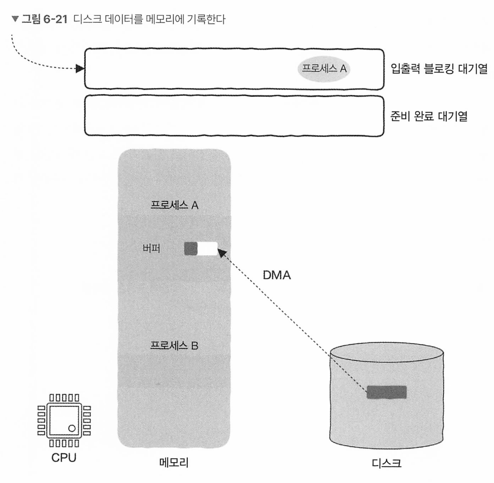

# 6장 입출력이 없는 컴퓨터가 있을까?

## 6.1 CPU는 어떻게 입출력 작업을 처리할까?

CPU 내부에 레지스터가 있는것처럼, 각각 IO 장치마다 장치 레지스터가 있다. 

* 서버에서는 ssd,hdd 데이터 저장장치, 네트워크 카드, 이더넷 포트, 라우터 스위치 등

CPU 레지스터는 메모리에서 읽은 데이터를 임시 저장하고

장치 레지스터는 데이터를 저장하는 레지스터와 제어 정보와 상태 정보를 저장하는 레지스터가 있따. 

### 6.1.1 입출력기계 명령어

어떻게 장치 레지스터를 읽고 쓰는가? 기계 명령어로 실행한다.

* x86은 IN, OUT 기계 명령어

장치마다 고유한 주소가 부여되어 입출력 명령어에 장치 주소를 지정한다. 

### 6.1.2 메모리 사상 입출력

LOAD, STORE 명령어는 메모리를 읽고 쓰는지, 장치 레지스터를 읽고 쓰는 것인지 구분할 수 없다. 

메모리 주소 공간 일부를 장치에 할당하여, 메모리를 읽고 쓰는것처럼 장치를 제어한다.

* 이 방법이 ememory mapping input and output 이다. 

즉 컴퓨터 저수준 계층에서는 두가지 입출력 구현 방법이 있따.

1. 특정 입출력 기계 명령어 사용
2. 메모리의 읽기 쓰기 명령어를 함께 쓰지만, 주소 공간의 일부를 장치에 할당한다.

CPU는 특정한 방법을 사용하여 장치의 작업 상태를 얻어온다. 

장치의 작업 상태는 장치 상태 레지스터에 저장하고 CPU가이걸 읽어간다

### 6.1.4 폴링 계속 검사하기

키보드에서 누른 키의 데이터를 레지스터가 oxfe01 위치에 사상

상태 레지스터는 주소 공간의 oxfe 00위치에 사상이라면

```
START
    LOAD R1, 0xFE00    ; R1 레지스터에 메모리 주소 0xFE00의 값을 로드
    BLZ START          ; R1이 0보다 작으면(음수이면) START로 분기 (무한 루프 가능성)
    LOAD R0, 0xFE01    ; R0 레지스터에 메모리 주소 0xFE01의 값을 로드
    BL OTHER_TASK      ; 무조건 OTHER_TASK 라벨로 분기 (브랜치 명령)
```

BLZ START는 현재 키보드 상태 레지스터 값이 0일때 즉 아무것도 누르지 않으면 시작 위치 START로 점프하여 다시 확인하는 루프이다.

이 방법은 폴링 방식이라고 부른다.

폴링은 동기식 설계방식이며, 매우 비효율적으로 보인다. 이를 비동기로 바꾸어 처리할 수 있다.

### 6.1.5 인터럽트 처리 (중단 처리)


CPU가 특정 프로세스의 명령어를 처리하고 있을 때, 네트워크 카드에 데이터가 들어오면 인터럽트 신호를 보낸다.

CPU는 현재 작업의 우선순위가 인터럽트 요청보다 높은지 판다하고 인터럽트가 높다면 현재 작업을 중단하고 인터럽트를 처리 그리고 원래 작업으로 돌아온다.


즉 이것을 봤을때 비동기로 계속 중단 -> 실행 -> 리턴 -> 중단 -> 실행 -> 리턴이 반복되는것이다.

그러나

CPU는 인터럽트 신호가 오는것을 어떻게 감지할까?

중단된 프로그램의 실행 상태를 저장하고 복원하는 방법은?

### 6.1.7 CPU는 인터럽트 신호를 어떻게 감지할까.

CPU가 명령어를 실행하는 과정은, 명령어 인출, 해독, 실행, 다시쓰기 같은 단계로 나뉜다.

여기에 인터럽트 신호를 감지하는 단계까 추가되어야 한다.

**하드웨어 인터럽트 (Hardware Interrupt)**

CPU 외부에서 **입출력 장치(I/O Device), 타이머, 오류 등**이 발생했을 때 **하드웨어 신호**를 통해 인터럽트를 전달

- 예: 키보드 입력, 마우스 클릭, 네트워크 패킷 도착 등
- **CPU가 인터럽트 요청(IRQ - Interrupt Request) 라인을 주기적으로 확인하면서 감지**.

🛠 **인터럽트 감지 과정**

1. CPU가 명령을 실행하는 도중 **인터럽트 컨트롤러(Interrupt Controller)** 가 인터럽트 신호를 보냄.
2. 현재 실행 중인 명령어를 완료한 후, **인터럽트 벡터 테이블(Interrupt Vector Table, IVT)** 에서 해당 인터럽트 핸들러(Interrupt Handler) 주소를 가져옴.
3. **해당 핸들러(Interrupt Service Routine, ISR)를 실행**하여 인터럽트 처리를 수행.
4. 인터럽트 처리가 끝나면 원래 실행 중이던 명령어로 복귀.


인터럽트 처리는 일반 함수의 호출과 비교했을 때 점프와 반환을 포함하고 있따는 것이 함수와 유사하다.

그리고 인터럽트도 인터럽트에 의해 중단될 수 있는데 어떻게 실행 상태를 저장하고 복원할까

자세히 보면 스택으로 구현할 수 있다. 

각 상태를 PC 레지스터와 상태 레지스터에서 복원하면서 계속 실행한다.

## 6.2 디스크가 입출력 처리시 CPU가 하는 일은?

최신 컴퓨터의 경우 디스크가 입출력 처리시 CPU 개입이 필요하지 않다.

CPU는 다른 스레드를 실행중이거나 커널 모드에서 커널 프로그램을 실행하느라 바쁠 수도, 유휴 일수도 있따.


디스크의 입출력 처리와 CPU가 실행하는 작업은 그림 6-9와 같이 서로 의존하지 않는 독립적 인 두 작업이므로 병행 처리가 가능하다.

디스크가 입출력 요청을 처리하는 전체 과정에서 왜 CPU 개입이 필요하지 않을까?

이를 이해하려면 장치 제어기, 직접 메모리 접근, 인터럽트의 관계를 이해해야 한다.

### 6.2.1 장치 제어기

디스크같은경우, 자체 마이크로 컴퓨터 시스템으로 발전하여 자체적인 프로세서와 펌웨어를 갖추고 있다.

이와 동시에 자신만의 버퍼나 레지스터를 갖추고 있어 장치에서 읽은 데이터나 장치에 저장할 데이터를 저장할 수 있다.

* 장치 드라이버 : 운영체제에 속한 코드
* 장치 제어기: 장치 드라이버에서 명령을 받아 외부 장치를 제어하는 하드웨어

장치 제어기는 OS에 해당하는 드라이버와 외부 장치를 연결하는 다리이며,

장치 제어기가 점점 더 복잡해지는 목적 중 하나가 바로 CPU를 해방시키는 것

### CPU가 직접 데이터를 복사해야 할까

CPU입장에서 데이터를 직접 복사하는 일은 리소스를 낭비하는 일이다.

그러나 데이터는 항상 장치와 메모리 사이에 전송되어야 한다. 이 작동 방식을 직접 메모리 접근이라고 한다

### 직접 메모리 접근

**직접 메모리 접근(DMA, Direct Memory Access)** 는 **CPU의 개입 없이** I/O 장치가 직접 메모리(RAM)와 데이터를 주고받을 수 있도록 하는 기능

1. **CPU가 DMA 컨트롤러(DMA Controller, DMAC)에 작업을 요청.**
2. **DMA 컨트롤러가 직접 I/O 장치와 RAM 간 데이터 전송 수행.**
3. **전송이 끝나면 인터럽트(IRQ)로 CPU에게 알림.**
4. **CPU는 데이터 전송이 완료된 후 결과만 확인.**

📌 **장점:**

*  CPU가 데이터 전송 과정에서 **직접 개입하지 않아 부하 감소**
*  I/O 장치와 RAM이 직접 데이터를 교환하여 **전송 속도 증가**
*  고속 데이터 처리가 필요한 **디스크, 네트워크, 멀티미디어 처리에 최적화**

### 6.2.4 전 과정 정리

스레드 1이 시스템 콜로 입출력 요청 시작시, OS는 스레드 1을 일시 중단하고 CPU를 스레드 2에 할당 하고 시작

이때 디스크가 동작하여 데이터 준비가 완료되면 DMA 장치가 직접 장치와 메모리 사이에서 데이터를 전송

데이터 전송이 완료되면 DMA 장치가 인터럽트를 이용해 CPU에게 알리고, CPU는 스레드 2의 실행을 일시 중지하고 DMA의 인터럽트를 처리. 

이때, OS는 스레드 1이 요청한 IO 작업이 처리된것을 확인했기 때문에 CPU를 다시 스레드 1에 할당하기로 결정하며 이어서 실행됌.

**여기에서 핵심은 디스크가 입출력 요청을 처리할 때 CPU가 그 자리에서 기다리지 않고 다른 스레드를 실행시키는것** 

## 6.3 파일을 읽을 때 프로그램에는 어떤 일이 발생할까?

### 6.3.1 메모리 관점에서 입출력

입출력은 사실 데이터 복사다. 디스크 <-> 메모리간 데이터를 복사하는것이다.

### 6.3.2 read 함수는 어떻게 파일을 읽을까.

파일을 읽는 코드는 일반적으로 데이터를 저장하는 버퍼를 정의한 후 read 계열의 함수를 호출한다.

외부장치가 io 작업을 실행하는것은 느리기 때문에 끝나기 전까지 프로세스는 진행될 수 없어 이것이 블로킹이다.



read가 호출되면 버퍼를 매개채로 비어두고, OS는 DMA에 요청을 해서 특정 메모리 영역으로 데이터를 복사한다.

이 메모리 영역이 매개체인 버퍼다.

* 블로킹 대기열 외에도 os에는 준비 완료 대기열이 존재하는데, 이 대기열은 다시 실행될 조건이 준비된 작업이 들어간다.

복사하는 동안 cpu는 프로세스 B를 실행하며 디스크(DMA)는 프로세스 A의 메모리 버퍼에 데이터를 쓴다.

이렇게 OS가 매우 바쁘게 CPU를 스케줄링 한다.

프로세스 A의 버퍼에 복사하는 작업이 완료되면 디스크는 CPU에 인터럽트 신호를 보내고, CPU는 해당 함수로 점프하여 프로세스 A가 이어 실행될 수 있다. 

OS가 준비 완료 대기열에 프로세스 A를 넣고 OS는 기존 실행되던 프로세스 B의 CPU 할당 시간이 끝나거나 인터럽트 받으면, 그제서야 A를 꺼내서 실행한다.

**그리고 파일 데이터는 직접 프로세스의 주소공간이 아닌, 일반적으로 먼저 OS 내부로 복사되며, 이후 운영 체제가 프로세스의 주소 공간으로 복사한다.** 

물론, OS를 우회하여 직접 데이터를 프로세스 주소공간에 복사하는 zero-copy 기법도 있다.

* 외부 api 호출시에도 프로세스 -> os -> NIC 카드로 전송되는데 여기서도 zero-copy 기법이 쓰일 수 있음. 
* zero-copy는

java.nio.FileChannel 사용시 zero-copy 가능

```java
import java.io.FileInputStream;
import java.io.FileOutputStream;
import java.nio.channels.FileChannel;

public class ZeroCopyExample {
    public static void main(String[] args) {
        String sourceFile = "source.txt";
        String destFile = "destination.txt";

        try (FileChannel sourceChannel = new FileInputStream(sourceFile).getChannel();
             FileChannel destChannel = new FileOutputStream(destFile).getChannel()) {
            
            long position = 0;
            long size = sourceChannel.size();

            // Zero-Copy 전송
            sourceChannel.transferTo(position, size, destChannel);
            
            System.out.println("Zero-Copy 전송 완료!");
        } catch (Exception e) {
            e.printStackTrace();
        }
    }
}

```

읽는 방식

```java
import java.io.RandomAccessFile;
import java.nio.MappedByteBuffer;
import java.nio.channels.FileChannel;

public class ZeroCopyMemoryMapped {
    public static void main(String[] args) {
        String filePath = "source.txt";

        try (RandomAccessFile file = new RandomAccessFile(filePath, "r");
             FileChannel fileChannel = file.getChannel()) {

            // 파일 크기 확인
            long fileSize = fileChannel.size();

            // Memory-mapped I/O (Zero-Copy 방식)
            MappedByteBuffer buffer = fileChannel.map(FileChannel.MapMode.READ_ONLY, 0, fileSize);

            // 데이터를 읽음
            for (int i = 0; i < fileSize; i++) {
                System.out.print((char) buffer.get());  // 파일 내용을 출력
            }

            System.out.println("\nZero-Copy Memory-Mapped I/O 완료!");

        } catch (Exception e) {
            e.printStackTrace();
        }
    }
}
```

### **Java NIO (New I/O)**

- `FileChannel.transferTo()` → `sendfile()` 기반 Zero-Copy 지원.
- `MappedByteBuffer` → `mmap()`을 사용하여 메모리 매핑.
- `DirectByteBuffer` → Heap을 거치지 않는 DirectBuffer 사용.

kafka, netty, cassandra, 등이 제로 카피 많이 사용함

## 6.4 높은 동시성의 비결 : 입출력 다중화

유닉스/리눅스 세계는 모든 것이 파일이다.

모든 입출력 장치도 파일이라는 개념으로 추상화 된다. 

* 디스크, 네트워크 데이터, 터미널, pipe...

모든 입출력 작업은 파일 읽기와 쓰기인 open, read, write를 이용해 읽고 쓸 수 있다.

seek를 이용해 읽고 쓰는 pointer 위치를 변경할 수 있으며 close로 파일을 닫을 수 있다.

### 6.4.1 파일 서술자 - file discriptor

```
read(buffer)
```

이상태로 어디서 읽는지 알 숙 ㅏ없다.

때문에 리눅스/유닉스 세계에서 파일의 위치를 지정해야 하는데, 파일 디스크립터를 이용한다.

파일을 열면 커널은 파일 디스크립터를 반환하며, 파일 작업 실행시에도 해당 디스크립터를 반환해야 한다.

커널은 이 파일 디스크립터(파일 숫자)로 파일을 찾아 작업을 완료한다.

```java
char buffer[LEN];
int fd = open(file_name);

read(fd_buffer)

-- 자바는 내부적으로 FileDescriptor 객체 사용함. 
import java.io.FileDescriptor;
import java.io.FileInputStream;
import java.io.IOException;
import java.lang.reflect.Field;

public class FileDescriptorExample {
    public static void main(String[] args) {
        try (FileInputStream fis = new FileInputStream("example.txt")) {
            FileDescriptor fd = fis.getFD();

            // FileDescriptor에서 실제 파일 디스크립터 번호 얻기 (리눅스에서만 가능)
            int fdInt = getFileDescriptorInt(fd);
            System.out.println("파일 디스크립터 번호: " + fdInt);

        } catch (IOException e) {
            e.printStackTrace();
        }
    }

    private static int getFileDescriptorInt(FileDescriptor fd) {
        try {
            Field field = FileDescriptor.class.getDeclaredField("fd");
            field.setAccessible(true);
            return field.getInt(fd);
        } catch (Exception e) {
            throw new RuntimeException("파일 디스크립터 번호를 가져올 수 없음", e);
        }
    }
}
```

### 6.4.2 다중 입출력을 어떻게 효율적으로 처리할까

http 통신은 소켓을 사용한다. 리눅스에서 소켓도 파일이다. 때문에 파일 디스크립터를 이용ㅎㄴ다.

3 way handshake 성공시 accept 함수 호출하여 연결을 얻고 파일 디스크립터를 얻는다.

이것으로 사용자와 통신한다

```
int conn_fd = accept(...);

if (read(conn_fd, buff) > 0) {
  작업(buff);
}
```

read는 일반적으로 블로킹이다.

때문에 여러 스레드를 만들어 각각 요청마다 사용해서 스레드가 블로킹되도 다른 스레드나 사용자 요청에 영향을 덜 미치게 할 수 있다.

이 방법이 스레드 퍼 리퀘스트 모델이며, 단점은 스레드 수가 많아질 수 있고 자원을 많이 소모하며, 전환에 많은 부담이 가해진다. 즉 높은 동시성을 얻을 수 없다.

이 문제의 핵심은, 파일 디스크립터 하나에 대응하는 IO 장치가 읽을 수 있는 상태인지, 미리 알수 없다는 것이다.

읽을 수 없거나 쓸 수 없는 상태에서 IO 요청을 보내봤자 스레드가 블로킹 되어 일시 중지 되기 때문이다.

아래처럼 생각해보자

### 6.4.3 상대방이 아닌 내가 전화하게 만들기.

read함수를 사용하면, 해당 파일 디스크립터에 대응하는 파일을 읽을 수 잇는지 여부를 매번 물어봐야 한다.

이보다 나은 방법은, 내가 관심잇는 대상인 파일 디스크립터를 커널에 알려주고, 커널에게 너가 대신 감시하다가 사용할 수 있는 디스크립터가 있으면 알려줘 라고 알려준다.

이 방법이 동시에 많은 수의 파일 디스크립터를 다룰 수 있는  입출력 다중화 기술이다. 

### 6.4.4 입출력 다중화

입출력ㄷ ㅏ중화는 다음과 같은 과정을 의미한다

1. 파일 디스크립터 획득.
2. 특정 함수 호출하여 커널에 알림. 이 함수를 먼저 리턴할테니, 이 파일 디스크립터를 감시하다 읽거나 쓸 수 있으면 반환해줘
3. 해당 함수가 반환되면 준비가 완료된 파일 디스크립터를 얻으므로, 이를 얻어 처리함

**리눅스 세계에서 입출력 다중화 기술을 사용하는 방법에는 select, poll, epoll 세 가지가 있다. 매우 중요** 

### 6.4.5 select, poll, epoll

비동기 IO 이벤트 처리 방식으로, 네트워크 소켓, 파일 디스크립터, IPC(Inter-Process Communication) 같은 **입출력(I/O) 이벤트를 감시하는 기법**

**주요 차이점은 성능, 확장성, 구현 방식**

| 방식       | 구조            | 성능                 | 단점                                        |
| ---------- | --------------- | -------------------- | ------------------------------------------- |
| **select** | 비트마스크 기반 | **느림 (O(N))**      | 파일 디스크립터(FD) 개수 제한 (1024~4096개) |
| **poll**   | 배열 기반       | **느림 (O(N))**      | FD 개수 제한 없음, 하지만 매번 전체 스캔    |
| **epoll**  | 이벤트 기반     | **빠름 (O(1)~O(N))** | 리눅스 전용 (Windows에서 지원 안 됨)        |

**즉, `select` → `poll` → `epoll` 순으로 성능이 개선됨.**
 **FD 개수가 많을수록 epoll이 유리함 (수천 개 이상의 FD를 다룰 때).**


select는 1024개 제한이 있으며, 호출은 블로킹된다. 파일 디스크립터 중 하나라도 읽기,쓰기 가능 이벤트가 나타나면 호출한 프로세스가 깨어난다. 하지만 프로세스가 깨어났을 때 어떤 파일 디스크립터가 사용가능한지 몰라서 처음부터 끝까지 확인해야 해서 O(n)의 시간이 걸리며, 효율이 매우 떨어지는 근본적인 원인이다.


poll과 select는 유사하며, poll이 select에 비해 최적화된 점은 감시 가능한 파일 디스크립터가 제한만 없다는것. 하지만 여전히 O(n)이다.


이 문제를 해결하려고 epoll이 나왔다.

파일 디스크립터 목록을 감시하다가, 특정 이벤트가 발생하면 해당 프로세스를 깨우면서 준비 완료된 파일 디스크립터가 준비 완료 목록에 추가된다. 프로세스가 처음부터 끝까지 확인할 필요 없이 바로 준비 완료된 파일 서술자를 직접 획득할 수 있다.

* **이벤트 기반 I/O 감지 (O(1)~O(N))** → FD 변경이 적으면 O(1)
* **epoll_ctl()을 통해 동적으로 FD 등록 및 삭제 가능**
* 두 가지 모드 지원
  1. **LT(Level-Triggered)**: 이벤트가 발생하면 계속 알림
  2. **ET(Edge-Triggered)**: 이벤트가 발생할 때만 알림 (고성능)

```c
#include <sys/epoll.h>
#include <stdio.h>
#include <unistd.h>

int main() {
    int epfd = epoll_create1(0);
    struct epoll_event event;
    event.events = EPOLLIN;
    event.data.fd = STDIN_FILENO;
    
    epoll_ctl(epfd, EPOLL_CTL_ADD, STDIN_FILENO, &event);

    struct epoll_event events[1];
    int ret = epoll_wait(epfd, events, 1, 5000);  // 5초 대기

    if (ret > 0) {
        printf("입력 감지됨\n");
    } else if (ret == 0) {
        printf("타임아웃\n");
    } else {
        printf("오류 발생\n");
    }

    close(epfd);
    return 0;
}
```

**장점**

- **이벤트 기반 비동기 I/O 감지** (`epoll_wait()`)
- **동적 FD 관리 가능 (`epoll_ctl()`)** → FD 추가/삭제 가능
- **O(1) 또는 O(N) 복잡도** (FD 변경이 적을수록 빠름)
- **레벨 트리거(LT) & 엣지 트리거(ET) 지원**
- **비블로킹 I/O 지원** (polling 없이 효율적 처리)

**단점**

- **리눅스 전용 (Windows에서 지원 안 됨)**
- **ET 모드는 구현이 까다로움**

```
epoll 주요 함수
epoll_create() → epoll 인스턴스 생성
epoll_ctl() → fd를 epoll에 추가/삭제/수정
epoll_wait() → 등록된 fd에서 이벤트가 발생할 때까지 대기

epoll은 내부적으로 red-black tree(RB 트리) 와 ready list(링크드 리스트) 를 사용

epoll_ctl() → RB 트리를 사용하여 fd를 저장 및 관리
epoll_wait() → ready list에서 이벤트가 발생한 fd를 O(1)로 조회 가능

epoll_wait()는 이벤트가 준비된 fd만 반환하므로, 감시하는 fd 개수와 관계없이 O(1) 성능을 유지할 수 있음.
fd 개수가 10개든 10만 개든 이벤트가 적으면 epoll_wait()는 O(1)로 동작
```

**fd 변경이 많으면 왜 느려지는가?**

epoll의 `epoll_ctl()`은 **RB 트리를 사용하여 fd를 관리**하는데,
 **RB 트리에 새로운 fd를 추가하거나 삭제하는 작업은 O(log N)의 시간 복잡도**가 발생

### **비교: epoll_wait() vs epoll_ctl()**

| 연산                     | 시간 복잡도 | 설명                                 |
| ------------------------ | ----------- | ------------------------------------ |
| `epoll_wait()`           | O(1)        | ready list에서 이벤트 발생 fd만 조회 |
| `epoll_ctl(ADD/DEL/MOD)` | O(log N)    | RB 트리에서 fd 추가/삭제/수정        |

따라서,

- **fd 변경이 적다면 `epoll_wait()`만 사용되므로 O(1)로 빠름**
- **fd 변경이 많다면 `epoll_ctl()`이 자주 호출되면서 O(log N) 비용이 누적됨 → 성능 저하**

특히 **대규모 네트워크 서버**에서 수천 개의 소켓이 빠르게 열리고 닫히는 경우(예: 웹 서버, 프록시 서버),
 **`epoll_ctl()` 호출이 많아져 CPU 사용량이 증가**하고 성능이 떨어질 수 있음.

변경이 많은경우 Linux 5.1 이상에서는 **io_uring**이 `epoll`보다 성능이 우수

* `io_uring`은 **Linux 커널 5.1**(2019년)에서 도입된 **비동기 I/O 프레임워크**로,
  기존의 `epoll()`, `select()`, `poll()` 같은 동기적 I/O 모델을 개선하여 **고성능 비동기 I/O를 지원**하는 기술

## 6.5 Mmap : 메모리 읽기 쓰기 방식으로 파일 처리

`mmap()`은 **파일 또는 디바이스의 데이터를 메모리에 매핑하는 시스템 호출**로,
 파일 I/O 성능을 최적화하고, 프로세스 간 공유 메모리(IPC)로도 사용할 수 있는 강력한 메커니즘


직접 메모리에 디스크의 파일을 올려 읽고 쓸 수 있다.

### 6.5.1 파일과 가상 메모리

메모리처럼 디스크에 저장된 파일도 연속된 공간에 저장되는것처럼 보인다.

가상 메모리를 이용해서 이 둘을 연관 지을 수 있다.

프로세스가 사용하는 주소 공간은 가상이기 때문에, 개념적으로 연속된 디스크 공간에 저장되어 있을 수 있다고 연속적으로 직접 사상할 수 있다. 

길이가 200바이트인 파일을 가상 메모리에 600~799 범위에 사상하면 된다

### 운영체제 덕분

600~799 주소를 읽을 때, 메모리에 적재되지 않았따면 페이지 폴트 인터럽트가 발생할 수 있다.

이때 os가 인터럽트를 처리하고, 실제 디스크를 읽고 파일을 메모리로 읽고 나서 가상 메모리랑 매핑한다.

쓰기작업은

이 메모리를 직접 수정하고, OS는 백그라운드에서 해당 내용을 디스크에 기록한다.

실제 디스크를 읽고 쓰는건 os가 하며, 프로그램은 일반 메모리를 이용하는것처럼 보인다.

### 6.5.3 mmap vs read/write

read 함수 사용시 커널 상태에서 사용자 상태로 복사해야 하며

write 함수 사용시 사용자 상태에서 커널 상태로 복사해야 한다. 이 작업들은 큰 리소스를 먹는다.

mmap은 이런 문제가 없다. 시스템 콜 부담이 없기 때문.

그러나 페이지 폴트 인터럽트 요청에 부함이 있고 커널마다 구현 방식이 달라서 

mmap이 항상 성능 면에서 read/write 함수보다 낫다고 할 수는 없다. 


**mmap()의 장점**

1. **Zero-Copy 지원 (불필요한 복사 제거)**
   - 기존 `read()` / `write()` 방식은 데이터를 유저 공간으로 복사해야 함
   - `mmap()`은 직접 메모리에 매핑하여 복사 없이 사용 가능
   - 메모리 매핑이 되어 있으므로, `memcpy()` 등의 연산을 수행하면 속도가 훨씬 빠름
2. **페이지 폴트(Page Fault) 기반 I/O (성능 최적화)**
   - `mmap()`은 처음부터 모든 데이터를 로드하지 않고, 필요한 데이터만 로드 (Page Fault 발생 시)
   - 대용량 파일을 로드할 때 매우 유용
3. **프로세스 간 공유 메모리 (IPC) 가능**
   - `MAP_SHARED` 플래그를 사용하면 여러 프로세스 간 메모리 공유 가능
   - IPC(Inter-Process Communication) 기법으로 활용 가능
4. **HugePage, Direct I/O 등과 조합하여 성능 최적화 가능**
   - `mmap()`은 HugePage(대용량 페이지 지원)와 함께 사용하면 TLB(Cache Miss)를 줄여 성능 향상 가능
   - `O_DIRECT` 플래그와 조합하여 디스크 I/O 성능을 극대화할 수 있음

**mmap() vs read() / write() 비교**

| 기능             | `mmap()`                     | `read()` / `write()`       |
| ---------------- | ---------------------------- | -------------------------- |
| I/O 방식         | 메모리 직접 접근 (Zero-Copy) | 시스템 콜 필요 (복사 발생) |
| 성능             | 빠름                         | 느림                       |
| 메모리 사용      | 파일 크기만큼 필요           | 버퍼 크기만큼 사용         |
| 페이지 폴트 활용 | 지원 (필요할 때만 로드)      | 불가능                     |
| 프로세스 간 공유 | 가능 (`MAP_SHARED`)          | 불가능                     |

즉, **`mmap()`은 대용량 파일 처리와 IPC에 적합**하고, **`read()`는 간단한 파일 처리에 적합**함.

### mmap()의 단점

1. **대량의 작은 파일 처리에는 부적합**
   - `mmap()`은 파일을 메모리에 매핑하는 과정에서 오버헤드 발생 가능
   - 작은 파일을 반복해서 처리해야 한다면 `read()`가 더 적합할 수도 있음
2. **메모리 부족 가능성**
   - 파일 크기만큼 가상 메모리가 필요하므로, 메모리가 부족하면 `mmap()`이 실패할 수 있음
   - 스왑이 많이 발생할 경우 성능 저하 가능
3. **SIGBUS 오류 발생 가능**
   - `mmap()`한 메모리를 접근할 때, 파일이 삭제되거나 변경되면 `SIGBUS` 오류 발생 가능
   - `read()`는 파일 변경에도 안전하지만, `mmap()`은 데이터 손실 가능성 있음

즉 대형 파일에서는 mmap이 좀 더 낫다!

## 6.6 컴퓨터 시스템의 각 부분에서 얼마큼 지연이 일어날까?

갓 제프딘 성님께서 정리한 통계 자료이다.

* 2012년 기준이라서 현대는 더 빠르겠지만.. 그래도 시스템 수치 계싼시 쓸모있다.

**시간 단위: ns = 나노초, μs = 마이크로초, ms = 밀리초, s = 초**)

* 1 밀리초(ms) = 1,000 마이크로초(μs)
* 1 마이크로초(μs) = 1,000 나노초(ns)
* 1 밀리초(ms) = 1,000,000 나노초(ns)**

| 작업                                           | 지연 시간 (latency) | 설명                                                  |
| ---------------------------------------------- | ------------------- | ----------------------------------------------------- |
| **CPU L1 캐시 접근**                           | **0.5 ns**          | CPU 내부의 가장 빠른 캐시 (한 사이클 내 접근)         |
| **CPU L2 캐시 접근**                           | **7 ns**            | L1보다 느리지만 여전히 매우 빠름                      |
| **CPU L3 캐시 접근**                           | **30 ns**           | 여러 코어가 공유하는 캐시                             |
| **RAM (메인 메모리) 접근**                     | **100 ns**          | L3 캐시보다 3배~10배 느림                             |
| **1MB 데이터 순차적 읽기 (RAM 내)**            | **250 ns**          | CPU가 캐시 미스를 내고 데이터를 메모리에서 가져올 때  |
| **SSD에서 데이터 읽기**                        | **100 μs (0.1 ms)** | 최신 NVMe SSD는 더 빠를 수도 있음                     |
| **HDD에서 데이터 읽기 (디스크 탐색 포함)**     | **10 ms**           | 회전하는 디스크에서 특정 데이터를 찾는 데 걸리는 시간 |
| **1GB 네트워크 전송 (데이터센터 내)**          | **500 μs (0.5 ms)** | 데이터센터 내부의 네트워크 전송                       |
| **데이터센터 내 RPC 호출**                     | **500 μs - 1 ms**   | 서버 간 원격 프로시저 호출 (RPC)                      |
| **데이터센터 간 네트워크 왕복 시간 (대륙 내)** | **30 ms**           | 미국 내 데이터센터 간 네트워크                        |
| **데이터센터 간 네트워크 왕복 시간 (대륙 간)** | **150 ms**          | 미국 ↔ 유럽 간 네트워크                               |
| **1GB 데이터 디스크에서 읽기 (HDD, 순차적)**   | **10 ms**           | HDD의 순차적 읽기                                     |
| **1GB 데이터 디스크에서 읽기 (SSD, 순차적)**   | **1 ms**            | SSD의 순차적 읽기                                     |
| **1GB 데이터 네트워크 전송 (WAN, 대륙 간)**    | **150 ms**          | 미국 ↔ 유럽 간 데이터 전송                            |


네트워크 지연시간 공식 = 

```
지연 시간 (ns) = (거리 (km) / 광케이블 속도 (km/s)) × 10^9

왕복 지연 시간 (RTT, ns) = 단방향 지연 시간 × 2

- 10^9 는 1,000,000,000 (10억)
- 일반적으로 광섬유(광케이블) 내 빛의 속도는 약 200,000 km/s
```

| 도시 간 거리           | 거리 (km) | 단방향 지연 시간 (ms) | 왕복 지연 시간 (ms) | 계산 공식                          |
| ---------------------- | --------- | --------------------- | ------------------- | ---------------------------------- |
| **서울 ↔ 부산**        | 325       | 1.625                 | 3.25                | (325 km) / (200,000 km/s) * 10^9   |
| **서울 ↔ 제주**        | 450       | 2.250                 | 4.50                | (450 km) / (200,000 km/s) * 10^9   |
| **서울 ↔ 베이징**      | 955       | 4.775                 | 9.55                | (955 km) / (200,000 km/s) * 10^9   |
| **서울 ↔ 일본 (도쿄)** | 1160      | 5.800                 | 11.60               | (1160 km) / (200,000 km/s) * 10^9  |
| **서울 ↔ LA**          | 9600      | 48.000                | 96.00               | (9600 km) / (200,000 km/s) * 10^9  |
| **서울 ↔ 실리콘밸리**  | 9500      | 47.500                | 95.00               | (9500 km) / (200,000 km/s) * 10^9  |
| **서울 ↔ 뉴욕**        | 11000     | 55.000                | 110.00              | (11000 km) / (200,000 km/s) * 10^9 |

